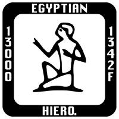
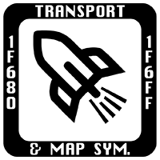
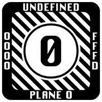
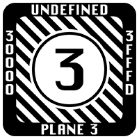
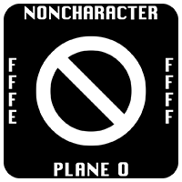

# Last Resort Font

*Last Resort* is a special-purpose font that includes a collection of glyphs to represent types of Unicode characters. These glyphs are specifically designed to allow users to recognize that a code point is one of the following:

* A specific type of Unicode character
* In the PUA (*Private Use Area*) for which no agreement exists
* Unassigned (reserved for future assignment)
* A noncharacter

## License

The use of the *Last Resort* font is covered under the terms of the [SIL Open Font License, Version 1.1](https://scripts.sil.org/OFL) license. 

## Downloading the font

The latest pre-built binary version of the *Last Resort* font, which corresponds to [Unicode Version 13.0.0](https://www.unicode.org/versions/Unicode13.0.0/), can be easily downloaded from the [Latest Release](https://github.com/unicode-org/last-resort-font/releases/latest/). This font may be updated for future versions of the Unicode Standard as time and resources permit.

**NOTE**: The *Last Resort* font’s 'cmap' table includes only a [Format 13](https://docs.microsoft.com/en-us/typography/opentype/spec/cmap#format-13-many-to-one-range-mappings) (*Many-to-one range mappings*) subtable, which may not be supported in some environments.

## Description

The glyphs of the *Last Resort* font are used as the backup of “last resort” to any other font: if the font cannot represent any particular Unicode character, the appropriate “missing” glyph from the *Last Resort* font is displayed instead. This provides users with the ability to more easily discern what type of character it is, and provides a clue as to what type of font they would need to display the characters properly. For more information, see *The Unicode Standard*, [Section 5.3](https://www.unicode.org/versions/Unicode13.0.0/ch05.pdf#G7730), *Unknown and Missing Characters*.

Overall, there are a number of advantages to using the *Last Resort* font for unrepresentable characters:

* Operating systems are freed from the overhead of providing a full Unicode font.
* Users see something more meaningful than a black box or other geometric shape for unrepresentable characters.
* Users familiar with the scripts being represented with the *Last Resort* font will readily identify what type of font needs to be installed in order to properly display the text.
* Users unfamiliar with the missing scripts are shown easily-identified symbols rather than lengthy strings of unidentifiable characters.

Unicode blocks are illustrated by a representative glyph from the block, chosen to be as distinct as possible from glyphs of other blocks. A square surrounding frame provides a common, recognizable element, and embedded within the edge of this frame, only visible at large size, are a form of the block name and its code point range to help identification.

&nbsp;&nbsp;&nbsp;

There are two particularly special types of glyphs in the font. One of the types represents any unassigned code point in an existing block. The other type represents the 66 noncharacter code points: U+FDD0..U+FDEF, U+FFFE..U+FFFF, U+1FFFE..U+1FFFF, U+2FFFE..U+2FFFF, U+3FFFE..U+3FFFF, U+4FFFE..U+4FFFF, U+5FFFE..U+5FFFF, U+6FFFE..U+6FFFF, U+7FFFE..U+7FFFF, U+8FFFE..U+8FFFF, U+9FFFE..U+9FFFF, U+AFFFE..U+AFFFF, U+BFFFE..U+BFFFF, U+CFFFE..U+CFFFF, U+DFFFE..U+DFFFF, U+EFFFE..U+EFFFF, U+FFFFE..U+FFFFF, and U+10FFFE..U+10FFFF.

&nbsp;&nbsp;&nbsp;

Example glyphs were chosen in a number of ways. For example, almost all of the Brahmic scripts show the initial consonant *ka*, such as ක for Sinhala. Latin uses the letter *A*, because it’s the first letter, and because in each Latin block there is a letter *A* that is easily distinguished. Greek and Cyrillic use their last letters, *Ω* and *Я*, respectively, due to their distinctiveness. Most other scripts use their initial character where distinctive.

The *Last Resort* glyphs were drawn by Apple Inc. and Michael Everson of [Evertype](https://www.evertype.com/).

## Building the fonts from source

**NOTE**: *The sources and build scripts may be added after Unicode Version 14.0.0 has been released (2021), and as time and resources permit.*

## Getting Involved

Although the *Last Resort* project is considered to be stable with no guarantee that it will be updated, suggestions can be provided by submitting a [new issue](https://github.com/unicode-org/last-resort-font/issues/new).
